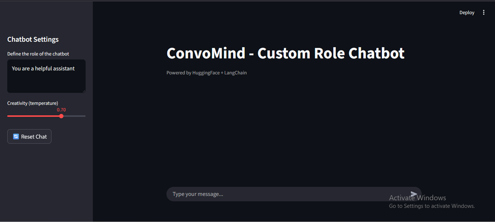

# 🤖 Custom Role Chatbot (Streamlit + LangChain)

A beautiful Streamlit-based chatbot powered by **LangChain** and **HuggingFace**, allowing users to dynamically define the chatbot’s role using system prompts.

---

## 🚀 Features

- 🎭 Dynamic chatbot roles (SystemMessage)
- 💬 Modern Streamlit chat UI
- ⚙️ Adjustable creativity (temperature)
- 🔄 Reset chat functionality
- 🧠 HuggingFace LLM integration

---

## 🧠 How It Works

1. User defines the chatbot’s role (system prompt)
2. Messages are stored using LangChain message objects
3. HuggingFace LLM generates contextual responses
4. Streamlit renders the conversation in a chat UI

---

## 🛠 Tech Stack

- Python
- Streamlit
- LangChain
- HuggingFace Hub

---

## 📦 Installation

```bash
gh repo clone jain-sahil-35/ConvoMind-custom-role-chatbot
cd custom-role-chatbot
pip install -r requirements.txt
```

## 🔑 Environment Variables (Create a .env file)
```env
HUGGINGFACEHUB_API_TOKEN=your_token_here
```

## ▶️ Run the App
```bash
streamlit run app.py
```

## 📸 Preview


## 📜 License
MIT License
